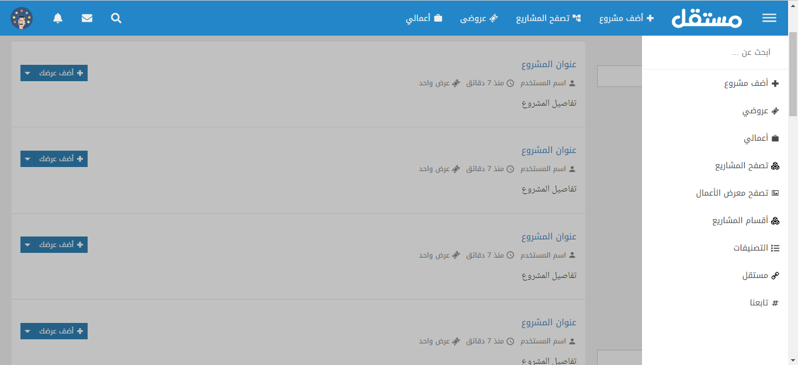

# Mostaql clone

Mostaql is a freelancing platform that connects freelancers with project owners.\
**link:** [mostaql.com](mostaql.com)\
in this project, I am trying to clone the UI of this website using React.js

### Demo

<a href="https://ibrahim-embaby.github.io/freelance-platform-MOSTAQL/
" target="_blank">https://ibrahim-embaby.github.io/freelance-platform-MOSTAQL/
</a>



## Install

```bash
npm install
```

## Usage

```bash
npm start
```

## Used Tools

<em> ReactJS, JSX, CSS
